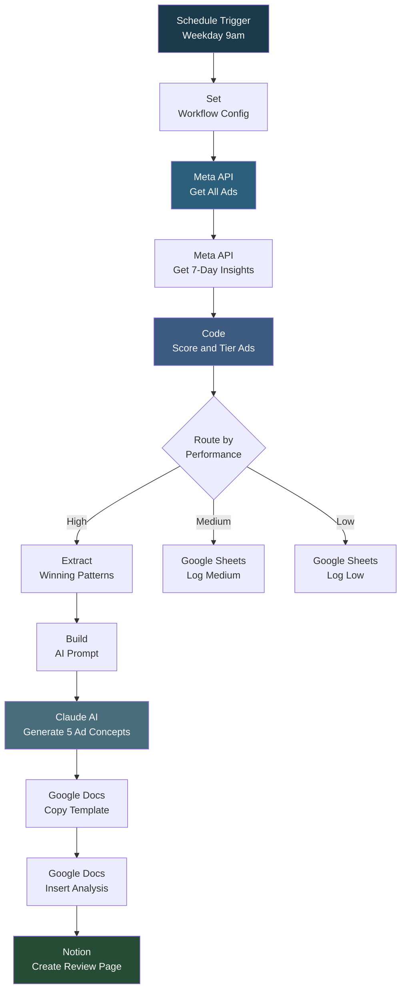

# Meta Ads Performance Analysis to AI-Generated Ad Concepts

## Overview

This workflow automates the entire Meta (Facebook) ads performance review cycle. Every weekday, it pulls ad performance data from the Meta Graph API, scores each ad based on CTR, CPC, and conversions, routes them into High/Medium/Low performance tiers, extracts winning patterns from top performers, and uses Claude AI to generate 5 new ad concepts based on what is working. The results are written to a Google Doc from a template and logged in a Notion database for team review. Errors trigger a Slack/Teams notification automatically.

## How It Works

```
Schedule (weekday 9am) -> Configure API keys -> Get Meta Ads -> Get Ad Insights (last 7 days) -> Score and tier each ad -> Route by performance (High/Medium/Low) -> Extract winning patterns from High -> Build AI prompt -> Claude generates 5 new ad concepts -> Copy Google Doc template -> Insert analysis + concepts -> Create Notion page with metrics + doc link
```

### Workflow Diagram



## Integrations

- **Meta Graph API** - Ad and insights data retrieval
- **Anthropic Claude (3.5 Sonnet)** - AI-generated ad concepts based on winning patterns
- **Google Docs** - Templated performance report generation
- **Google Sheets** - Medium and low performer logging
- **Notion** - Review tracking database with metrics and doc links
- **Slack/Teams** - Error notifications via webhook

## Setup

1. Import `Meta_Ads_Performance_Analysis_to_AI_Generated_Ad_Concepts.json` into your n8n instance.
2. Update the Workflow Configuration node with your Meta Ad Account ID, Meta Access Token, Claude API Key, Google Doc Template ID, and Notion Database ID.
3. Configure Google OAuth2 credentials for Docs and Sheets.
4. Configure Notion credentials.
5. Set the error notification webhook URL (Slack or Teams).
6. Customize the performance scoring thresholds if needed.
7. Activate the workflow.
